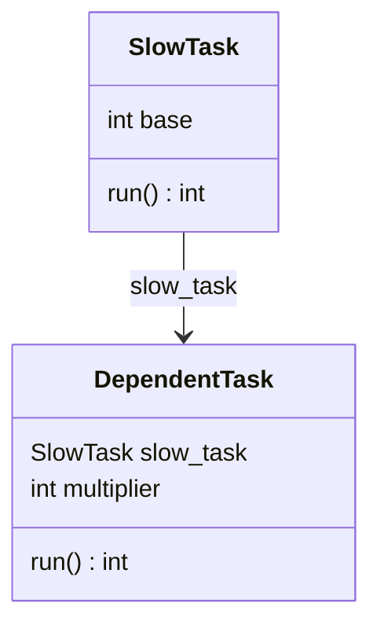

<div align="center">

<h1>labtech</h1>

<a href="">
    
</a>

<p>
    <a href="https://github.com/ben-denham/labtech">GitHub</a> - <a href="https://ben-denham.github.io/labtech">Documentation</a>
</p>

</div>

Labtech makes it easy to define multi-step experiment pipelines and
run them with maximal parallelism and result caching:

* **Defining tasks is simple**; write a class with a single `run()`
  method and parameters as dataclass-style attributes.
* **Flexible experiment configuration**; simply create task objects
  for all of your parameter permutations.
* **Handles pipelines of tasks**; any task parameter that is itself a
  task will be executed first and make its result available to its
  dependent task(s).
* **Implicit parallelism**; Labtech resolves task dependencies and
  runs tasks in sub-processes with as much parallelism as possible.
* **Implicit caching and loading of task results**; configurable and
  extensible options for how and where task results are cached.
* **Integration with [mlflow](https://mlflow.org/)**; Automatically
  log task runs to mlflow with all of their parameters.


## Installation

```
pip install labtech
```


## Usage

```python
from time import sleep

import labtech

# Decorate your task class with @labtech.task:
@labtech.task
class Experiment:
    # Each Experiment task instance will take `base` and `power` parameters:
    base: int
    power: int

    def run(self) -> int:
        # Define the task's run() method to return the result of the experiment:
        labtech.logger.info(f'Raising {self.base} to the power of {self.power}')
        sleep(1)
        return self.base ** self.power

def main():
    # Configure Experiment parameter permutations
    experiments = [
        Experiment(
            base=base,
            power=power,
        )
        for base in range(5)
        for power in range(5)
    ]

    # Configure a Lab to run the experiments:
    lab = labtech.Lab(
        # Specify a directory to cache results in (running the experiments a second
        # time will just load results from the cache!):
        storage='demo_lab',
        # Control the degree of parallelism:
        max_workers=5,
    )

    # Run the experiments!
    results = lab.run_tasks(experiments)
    print([results[experiment] for experiment in experiments])

if __name__ == '__main__':
    main()
```


Labtech can also produce graphical progress bars in
[Jupyter](https://jupyter.org/) when the `Lab` is initialized with
`notebook=True`:


Tasks parameters can be any of the following types:

* Simple scalar types: `str`, `bool`, `float`, `int`, `None`
* Collections of any of these types: `list`, `tuple`, `dict`, `Enum`
* Task types: A task parameter is a "nested task" that will be
  executed before its parent so that it may make use of the nested
  result.

Here's an example of defining a single long-running task to produce a
result for a large number of dependent tasks:

```python
from time import sleep

import labtech

@labtech.task
class SlowTask:
    base: int

    def run(self) -> int:
        sleep(5)
        return self.base ** 2

@labtech.task
class DependentTask:
    slow_task: SlowTask
    multiplier: int

    def run(self) -> int:
        return self.multiplier * self.slow_task.result

def main():
    some_slow_task = SlowTask(base=42)
    dependent_tasks = [
        DependentTask(
            slow_task=some_slow_task,
            multiplier=multiplier,
        )
        for multiplier in range(10)
    ]

    lab = labtech.Lab(storage='demo_lab')
    results = lab.run_tasks(dependent_tasks)
    print([results[task] for task in dependent_tasks])

if __name__ == '__main__':
    main()
```

Labtech can even generate a [Mermaid diagram](https://mermaid.js.org/syntax/classDiagram.html)
to visualise your tasks:

```python
from labtech.diagram import display_task_diagram

some_slow_task = SlowTask(base=42)
dependent_tasks = [
    DependentTask(
        slow_task=some_slow_task,
        multiplier=multiplier,
    )
    for multiplier in range(10)
]

display_task_diagram(dependent_tasks)
```



To learn more, dive into the following resources:

* [The labtech tutorial](https://ben-denham.github.io/labtech/tutorial) ([as an interactive notebook](https://mybinder.org/v2/gh/ben-denham/labtech/main?filepath=examples/tutorial.ipynb))
* [Cookbook of common patterns](https://ben-denham.github.io/labtech/cookbook) ([as an interactive notebook](https://mybinder.org/v2/gh/ben-denham/labtech/main?filepath=examples/cookbook.ipynb))
* [API reference for Labs and Tasks](https://ben-denham.github.io/labtech/core)
* [More options for cache formats and storage providers](https://ben-denham.github.io/labtech/caching)
* [Diagramming tools](https://ben-denham.github.io/labtech/diagram)
* [More examples](https://github.com/ben-denham/labtech/tree/main/examples)


## Mypy Plugin

For [mypy](https://mypy-lang.org/) type-checking of classes decorated
with `labtech.task`, simply enable the labtech mypy plugin in your
`mypy.ini` file:

```INI
[mypy]
plugins = labtech.mypy_plugin
```

## Contributing

* Install Poetry dependencies with `make deps`
* Run linting, mypy, and tests with `make check`
* Documentation:
    * Run local server: `make docs-serve`
    * Build docs: `make docs-build`
    * Deploy docs to GitHub Pages: `make docs-github`
    * Docstring style follows the [Google style guide](https://google.github.io/styleguide/pyguide.html#38-comments-and-docstrings)

## TODO

* Add unit tests
