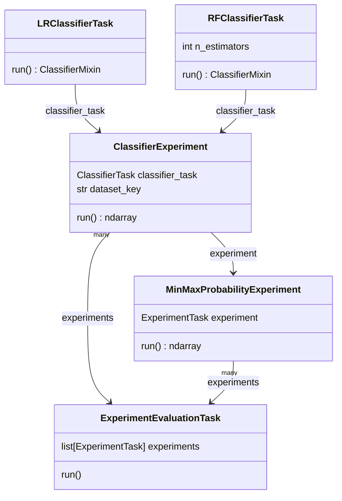

## Labtech Tutorial

The following tutorial presents a complete example of using labtech to
easily add parallelism and caching to machine learning experiments.

You can also run this tutorial as an [interactive notebook](https://mybinder.org/v2/gh/ben-denham/labtech/main?filepath=examples/tutorial.ipynb).

Before we begin, let's install `labtech` along with some other
dependencies we will use in this tutorial:

``` {.code}
%pip install labtech mlflow scikit-learn
```

Let's also clear any caches that were created by previous runs of this
tutorial:

``` {.code}
!rm -rf storage/tutorial/
!mkdir -p storage/tutorial/
```

### Running a single experiment as a labtech task

To get started, we'll take the following simple machine learning
experiment code and convert it to be run with labtech.

``` {.python .code}
from sklearn import datasets
from sklearn.preprocessing import StandardScaler
from sklearn.ensemble import RandomForestClassifier
from sklearn.metrics import log_loss

digits_X, digits_y = datasets.load_digits(return_X_y=True)
digits_X = StandardScaler().fit_transform(digits_X)

clf = RandomForestClassifier(
    n_estimators=5,
    random_state=42,
)
clf.fit(digits_X, digits_y)
prob_y = clf.predict_proba(digits_X)

print(f'{log_loss(digits_y, prob_y) = :.3}')
```

Throughout this tutorial, we will use labtech to improve and extend
this experiment, which currently:

1. Loads and scales the `digits` dataset.
    * This is a benchmark dataset where the goal is to train a
      classifier that can correctly assign a number between 0 and 9 to
      the image of a hand-written digit.
    * We will want to extend our experimentation to also include other
      datasets.
2. Trains a random forest classifier on the digits dataset.
    * The classifier is configured with `n_estimators=5` (i.e. a forest
      of 5 trees) and a fixed `random_state` (to ensure we get the same
      result every time we run the code).
    * We will want to extend our experimentation to test other
      `n_estimators` values and classifiers other than a random forest.
3. Evaluates the classifier by calculating the logistic loss of
   probabilities predicted by the classifier for the dataset.
    * Standard evaluation practice would be to calculate loss for a
      separate test dataset, but we will use a single dataset for both
      training and testing to simplify this tutorial.

Let's set up this same experiment to be run with labtech, providing us
with a foundation that we can extend throughout this tutorial.

First, we'll define a labtech *task type* that will load the dataset,
train the classifier, and return the probabilities predicted for the
dataset. Defining a task type for our experiment is as simple as
defining a class decorated with `@labtech.task` that defines a `run()`
method that performs the experiment and returns its result (the
predicted probabilities):

``` {.python .code}
import labtech

@labtech.task
class ClassifierExperiment:

    def run(self):
        digits_X, digits_y = datasets.load_digits(return_X_y=True)
        digits_X = StandardScaler().fit_transform(digits_X)

        clf = RandomForestClassifier(
            n_estimators=5,
            random_state=42,
        )
        clf.fit(digits_X, digits_y)
        prob_y = clf.predict_proba(digits_X)
        return prob_y
```

Next, we create a labtech *lab* that can be used to execute the
experiment. We'll configure the lab to cache results in a folder
called `storage/tutorial/classification_lab_1` and to display
notebook-friendly progress bars:

``` {.python .code}
lab = labtech.Lab(storage='storage/tutorial/classification_lab_1')
```

Finally, we create a task instance of `ClassifierExperiment` and call
`lab.run_task()` to run it. The output will be the predicted
probabilities returned by the task's `run()` method, so we can
calculate the loss from them as before:

``` {.python .code}
classifier_experiment = ClassifierExperiment()
prob_y = lab.run_task(classifier_experiment)
print(f'{log_loss(digits_y, prob_y) = :.3}')
```

An immediate benefit of running an experiment this way with labtech is
that **the result will be cached to disk for future use**. Any future
calls to run the same experiment (even after restarting Python) will
load the result from the cache:

``` {.python .code}
prob_y = lab.run_task(classifier_experiment)
print(f'{log_loss(digits_y, prob_y) = :.3}')
```

Defining the task to return the prediction probabilities instead of
just the loss metric gives us flexibility to change the evaluation in
the future (e.g. from `log_loss` to another metric) while still being
able to re-use the same cached result.

We can also ask our lab to return `task` objects for all previously
cached results for a given task type by calling `lab.cached_tasks()`.
A given task could then be passed to `lab.run_task()` to load it's
result (or we could pass a list of tasks to `lab.run_tasks()`, as we
will see in the next section of this tutorial).

``` {.python .code}
lab.cached_tasks([
    ClassifierExperiment,
])
```

**Whenever you make a change that will impact the behaviour of a task
(i.e. most changes to the `run()` method or the code it depends on),
it is very important that you add or update the `code_version` in
`@task` (e.g. `@task(code_version='v2')`).** Labtech will re-run tasks
if there are no cached results with a `code_version` matching your
current code. If you don't update the `code_version` or otherwise
clear your cache, then the returned cached results may no longer
reflect the actual results of your current code.

You may like to save storage space by clearing up old cached results
with `lab.uncache_tasks()`:

``` {.python .code}
lab.uncache_tasks([
    classifier_experiment,
])
```

### Parameterising tasks, and running many tasks in parallel

Let's extend our experimentation to compare the results for
classifiers configured with different `n_estimators` values.

To do so, we'll add an `n_estimators` parameter to our
`ClassifierExperiment` task type and reference it within the `run()`
method as `self.n_estimators`. Task parameters are declared in exactly
the same way as
[dataclass](https://docs.python.org/3/library/dataclasses.html)
fields:

``` {.python .code}
import labtech

@labtech.task
class ClassifierExperiment:
    n_estimators: int

    def run(self):
        digits_X, digits_y = datasets.load_digits(return_X_y=True)
        digits_X = StandardScaler().fit_transform(digits_X)

        clf = RandomForestClassifier(
            n_estimators=self.n_estimators,
            random_state=42,
        )
        clf.fit(digits_X, digits_y)
        prob_y = clf.predict_proba(digits_X)
        return prob_y
```

Now we'll use a list comprehension to construct a list of
`ClassifierExperiment` tasks with different `n_estimators` values:

``` {.python .code}
classifier_experiments = [
    ClassifierExperiment(
        n_estimators=n_estimators,
    )
    for n_estimators in range(1, 11)
]
```

We can run a list of tasks with `lab.run_tasks()`, which has the added
benefit of leveraging Python's multiprocessing capabilities to **run
the tasks in parallel** - running as many tasks simultaneously as
possible with the CPU of the machine running the tasks. Also, because
we've changed the definition of our `ClassifierExperiment` class,
we'll keep caches for the new definition separate by constructing a
new lab that uses a different storage directory:

``` {.python .code}
lab = labtech.Lab(storage='storage/tutorial/classification_lab_2')
results = lab.run_tasks(classifier_experiments)
```

`lab.run_tasks()` returns a dictionary mapping each input task to the
result it returned, which we can loop over to print loss metrics for
each experiment:

``` {.python .code}
for experiment, prob_y in results.items():
    print(f'{experiment}: {log_loss(digits_y, prob_y) = :.3}')
```

### Maximising concurrency and caching with dependent tasks

Labtech's true power lies in its ability to manage complex networks of
dependent tasks - automatically running as many tasks as possible in
parallel (even different types of tasks) and re-using cached results
wherever possible.

To demonstrate this, let's extend our experimentation with a new
post-processing step that will take the probabilities returned by one
of our previous `ClassifierExperiment` tasks and assign a probability
of `1` to the most likely class for each record (and conversely assign
a probability of `0` to all other classes).

To achieve this, we will define a new `MinMaxProbabilityExperiment`
task type that accepts a `ClassifierExperiment` as a parameter.
Labtech will consider any task in a parameter to be a *dependency* of
the task. Dependency tasks will be run before any of their dependent
tasks, allowing us to access the result from the `.result` attribute
of the task parameter (i.e. `self.classifier_experiment.result`):

``` {.python .code}
import numpy as np


@labtech.task
class MinMaxProbabilityExperiment:
    classifier_experiment: ClassifierExperiment

    def run(self):
        prob_y = self.classifier_experiment.result
        # Replace the maximum probability in each row with 1,
        # and replace all other probabilities with 0.
        min_max_prob_y = np.zeros(prob_y.shape)
        min_max_prob_y[np.arange(len(prob_y)), prob_y.argmax(axis=1)] = 1
        return min_max_prob_y
```

We can then construct and run a list of `MinMaxProbabilityExperiment`
tasks that depend on our previous `ClassifierExperiment` tasks in
`classifier_experiments`. Labtech will ensure each of the
`classifier_experiments` has been run before it's dependent
`MinMaxProbabilityExperiment` is run, re-using results depended on by
multiple tasks and loading previously cached results wherever
possible:

``` {.python .code}
min_max_prob_experiments = [
    MinMaxProbabilityExperiment(
        classifier_experiment=classifier_experiment,
    )
    for classifier_experiment in classifier_experiments
]

results = lab.run_tasks(min_max_prob_experiments)
for experiment, prob_y in results.items():
    print(f'{experiment}: {log_loss(digits_y, prob_y) = :.3}')
```

By simply specifying task dependencies, you can construct any task
structure that can be expressed as a [directed acyclic graph (or
DAG)](https://en.wikipedia.org/wiki/Directed_acyclic_graph) and let
labtech handle running tasks concurrently, sharing results between
dependent tasks, and using caches wherever possible.

### Parameterising tasks with complex objects

Now let's extend our experimentation to compare different classifier
models. We'd like to make the classifier itself a parameter to the
task, but task parameters can only be [json-serializable
values](https://ben-denham.github.io/labtech/core/#labtech.task) or
dependency tasks. Therefore, we will use dependency tasks to construct
and return classifier objects to our experiment tasks. We achieve this
in the following code by:

1. Defining `RFClassifierTask` and `LRClassifierTask` task types.
    * `RFClassifierTask` returns a random forest classifier
      parameterised by an `n_estimators` value.
    * `LRClassifierTask` returns a logistic regression classifier.
    * Because constructing a classifier object is inexpensive, we don't
      need to cache them, so we set `cache=None` in the `@labtech.task`
      decorator for these task types.
    * For type hinting purposes, we will identify these task types
      with the `ClassifierTask`
      [Protocol](https://docs.python.org/3/library/typing.html#typing.Protocol),
      which will match any task type that returns an sklearn
      classifier.
1. Redefining `ClassifierExperiment` to be parameterised by a
   `ClassifierTask`.
    * The classifier object to be trained and applied is retrieved
      from the `ClassifierTask` result with
      `self.classifier_task.result`.
    * Because one `ClassifierTask` result may be shared by many
      `ClassifierExperiment` tasks, the `run()` method first creates
      its own copy of the classifier with `clone()`.

``` {.python .code}
from typing import Protocol

from sklearn.base import clone, ClassifierMixin
from sklearn.ensemble import RandomForestClassifier
from sklearn.linear_model import LogisticRegression


class ClassifierTask(Protocol):

    def run(self) -> ClassifierMixin:
        pass


@labtech.task(cache=None)
class RFClassifierTask:
    n_estimators: int

    def run(self) -> ClassifierMixin:
        return RandomForestClassifier(
            n_estimators=self.n_estimators,
            random_state=42,
        )


@labtech.task(cache=None)
class LRClassifierTask:

    def run(self) -> ClassifierMixin:
        return LogisticRegression(
            random_state=42,
        )


@labtech.task
class ClassifierExperiment:
    classifier_task: ClassifierTask

    def run(self):
        digits_X, digits_y = datasets.load_digits(return_X_y=True)
        digits_X = StandardScaler().fit_transform(digits_X)

        clf = clone(self.classifier_task.result)
        clf.fit(digits_X, digits_y)
        prob_y = clf.predict_proba(digits_X)
        return prob_y
```

Now we can generate and run a set of `RFClassifierTask` tasks for
various `n_estimators` values, and construct a `ClassifierExperiment`
for each of these `RFClassifierTask` tasks as well as an
`LRClassifierTask` task:

``` {.python .code}
rf_classifier_tasks = [
    RFClassifierTask(
        n_estimators=n_estimators,
    )
    for n_estimators in range(1, 11)
]
classifier_experiments = [
    ClassifierExperiment(
        classifier_task=classifier_task,
    )
    for classifier_task in [
        LRClassifierTask(),
        *rf_classifier_tasks,
    ]
]

lab = labtech.Lab(storage='storage/tutorial/classification_lab_3')

results = lab.run_tasks(classifier_experiments)
for experiment, prob_y in results.items():
    print(f'{experiment}: {log_loss(digits_y, prob_y) = :.3}')
```

### Providing large objects as context

Sometimes we want to pass large, unchanging objects to our tasks, but
don't want to be forced to load them in a dependent task. For example,
it would be convenient to load a collection of datasets (on which to
run our experiments) outside of any task, allowing us to inspect these
datasets before and after the tasks have been run:

``` {.python .code}
iris_X, iris_y = datasets.load_iris(return_X_y=True)
iris_X = StandardScaler().fit_transform(iris_X)

DATASETS = {
    'digits': {'X': digits_X, 'y': digits_y},
    'iris': {'X': iris_X, 'y': iris_y},
}
```

To achieve this, a labtech lab can be provided with a *context* that
is made available to all tasks. In the following code, we:

1. Pass a `context` to the `labtech.Lab()` constructor, with a
   `'DATASETS'` key for the set of `DATASETS` defined above.
2. Redefine `ClassifierExperiment` to accept a `dataset_key` parameter
   and use it to look up a dataset inside the `'DATASETS'` key of the
   context, which is made available by labtech as `self.context`.
3. Alter the task generation and evaluation code to handle multiple
   datasets.

``` {.python .code}
@labtech.task
class ClassifierExperiment:
    classifier_task: ClassifierTask
    dataset_key: str

    def run(self):
        dataset = self.context['DATASETS'][self.dataset_key]
        X, y = dataset['X'], dataset['y']

        clf = clone(self.classifier_task.result)
        clf.fit(X, y)
        prob_y = clf.predict_proba(X)
        return prob_y


classifier_experiments = [
    ClassifierExperiment(
        classifier_task=classifier_task,
        dataset_key=dataset_key,
    )
    # By including multiple for clauses, we will produce a ClassifierExperiment
    # for every combination of dataset_key and classifier_task
    for dataset_key in DATASETS.keys()
    for classifier_task in [LRClassifierTask(), *rf_classifier_tasks]
]

lab = labtech.Lab(
    storage='storage/tutorial/classification_lab_4',
    context={
        'DATASETS': DATASETS,
    },
)

results = lab.run_tasks(classifier_experiments)
for experiment, prob_y in results.items():
    dataset_y = DATASETS[experiment.dataset_key]["y"]
    print(f'{experiment}: {log_loss(dataset_y, prob_y) = :.3}')
```

The lab context can also be useful for passing parameters to a task
that won't affect its result and therefore don't need to be part of
the task's formal parameters. For example: log levels and
task-internal parallelism settings.

**It is important that you do NOT make changes to context values that
impact task results after you have started caching experiment
results** - otherwise your cached results may not reflect your latest
context values.

### Bringing it all together and aggregating results

The following code brings all the steps from this tutorial together in
one place, with some additional improvements:

* The "experiment-like" `ClassifierExperiment` and
  `MinMaxProbabilityExperiment` task types are now identified by a
  common `ExperimentTask` Protocol (which requires each of those
  classes to provide a `dataset_key` attribute or property that is
  used by the new `ExperimentEvaluationTask`).
* A new, final, `ExperimentEvaluationTask` task that depends on all
  `ExperimentTask` tasks is used to compute the loss metric for all
  experiments.
    * A final task like this is useful once we have a large number of
      experiments as it allows us to cache the final evaluation of all
      tasks, meaning that we only need to load experiment results and
      re-calculate metrics when experiment parameters have changed or
      new experiments have been added.
* We enable labtech's integration with [`mlflow`](https://mlflow.org/)
  by the following additions (see [How can I use labtech with mlfow?](https://ben-denham.github.io/labtech/cookbook/#how-can-i-use-labtech-with-mlflow)
  for details):
    1. We add `mlflow_run=True` to the `@labtech.task` decorator of
       `ClassifierExperiment` and `MinMaxProbabilityExperiment`,
       indicating that each task of these types should be recorded as
       a "run" in mflow.
    2. We name the over-arching mlflow "experiment" with
       `mlflow.set_experiment('example_labtech_experiment')` before
       the tasks are run.


``` {.python .code}
from typing import Protocol

import labtech
from sklearn.base import clone, ClassifierMixin


# === Prepare Datasets ===

from sklearn import datasets
from sklearn.preprocessing import StandardScaler

digits_X, digits_y = datasets.load_digits(return_X_y=True)
digits_X = StandardScaler().fit_transform(digits_X)

iris_X, iris_y = datasets.load_iris(return_X_y=True)
iris_X = StandardScaler().fit_transform(iris_X)

DATASETS = {
    'digits': {'X': digits_X, 'y': digits_y},
    'iris': {'X': iris_X, 'y': iris_y},
}


# === Classifier Tasks ===

from sklearn.ensemble import RandomForestClassifier
from sklearn.linear_model import LogisticRegression


class ClassifierTask(Protocol):

    def run(self) -> ClassifierMixin:
        pass


@labtech.task(cache=None)
class RFClassifierTask:
    n_estimators: int

    def run(self) -> ClassifierMixin:
        return RandomForestClassifier(
            n_estimators=self.n_estimators,
            random_state=42,
        )


@labtech.task(cache=None)
class LRClassifierTask:

    def run(self) -> ClassifierMixin:
        return LogisticRegression(
            random_state=42,
        )


# === Experiment Tasks ===

class ExperimentTask(Protocol):
    dataset_key: str

    def run(self) -> ClassifierMixin:
        pass


@labtech.task(mlflow_run=True)
class ClassifierExperiment(ExperimentTask):
    classifier_task: ClassifierTask
    dataset_key: str

    def run(self) -> np.ndarray:
        dataset = self.context['DATASETS'][self.dataset_key]
        X, y = dataset['X'], dataset['y']

        clf = clone(self.classifier_task.result)
        clf.fit(X, y)
        prob_y = clf.predict_proba(X)
        return prob_y


@labtech.task(mlflow_run=True)
class MinMaxProbabilityExperiment(ExperimentTask):
    experiment: ExperimentTask

    @property
    def dataset_key(self):
        return self.experiment.dataset_key

    def run(self) -> np.ndarray:
        prob_y = self.experiment.result
        # Replace the maximum probability in each row with 1,
        # and replace all other probabilities with 0.
        min_max_prob_y = np.zeros(prob_y.shape)
        min_max_prob_y[np.arange(len(prob_y)), prob_y.argmax(axis=1)] = 1
        return min_max_prob_y


# === Results Aggregation ===

from sklearn.metrics import log_loss


@labtech.task
class ExperimentEvaluationTask:
    experiments: list[ExperimentTask]

    def run(self):
        return {
            experiment: {'log_loss': log_loss(
                self.context['DATASETS'][experiment.dataset_key]['y'],
                experiment.result,
            )}
            for experiment in self.experiments
        }


# === Task Construction ===

rf_classifier_tasks = [
    RFClassifierTask(
        n_estimators=n_estimators,
    )
    for n_estimators in range(1, 11)
]

classifier_experiments = [
    ClassifierExperiment(
        classifier_task=classifier_task,
        dataset_key=dataset_key,
    )
    for dataset_key in DATASETS.keys()
    for classifier_task in [LRClassifierTask(), *rf_classifier_tasks]
]

min_max_prob_experiments = [
    MinMaxProbabilityExperiment(
        experiment=classifier_experiment,
    )
    for classifier_experiment in classifier_experiments
]

evaluation_task = ExperimentEvaluationTask(
    experiments=[
        *classifier_experiments,
        *min_max_prob_experiments,
    ]
)


# === Task Execution ===

import mlflow

mlflow.set_experiment('example_labtech_experiment')
lab = labtech.Lab(
    storage='storage/tutorial/classification_lab_final',
    context={
        'DATASETS': DATASETS,
    },
)

evaluation_result = lab.run_task(evaluation_task)
for experiment, result in evaluation_result.items():
    print(f'{experiment}: log_loss = {result["log_loss"]:.3}')
```

### Visualising tasks and dependencies

Finally, we can use Labtech to generate a diagram of a list of tasks
that shows all of the task types, parameters, and dependencies:

``` {.python .code}
from labtech.diagram import display_task_diagram

display_task_diagram([
    evaluation_task,
], direction='BT')
```



Such diagrams can help you visualise how your experiments are running,
and may be useful to include in project documentation.

### Next steps

Congratulations on completing the labtech tutorial! You're now ready
to manage complex experiment workflows with ease!

To learn more about labtech, you can dive into the following
resources:

* [Cookbook of common patterns](https://ben-denham.github.io/labtech/cookbook) ([as an interactive notebook](https://mybinder.org/v2/gh/ben-denham/labtech/main?filepath=examples/cookbook.ipynb))
* [API reference for Labs and Tasks](https://ben-denham.github.io/labtech/core)
* [More options for cache formats and storage providers](https://ben-denham.github.io/labtech/caching)
* [Diagramming tools](https://ben-denham.github.io/labtech/diagram)
* [More examples](https://github.com/ben-denham/labtech/tree/main/examples)
